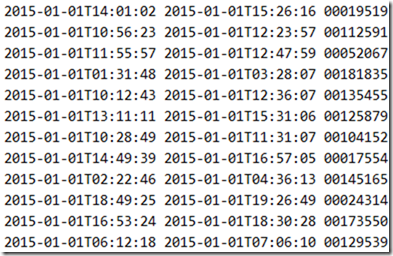

# Ayende's interview question

The task is described [here](https://ayende.com/blog/176034/making-code-faster-the-interview-question).

> We have the following file (the full data set is 276 MB), that contains the entry / exit log to a parking lot.
> 
> 
> 
> The first value is the entry time, the second is the exit time and the third is the car id.
> 
> Details about this file: This is UTF8 text file with space separated values using Windows line ending.
> 
> What we need to do is to find out how much time a car spent in the lot based on this file.

The data and the original solution are included inside `/task` directory.

### Usage

```bash
cd cloned-project-directory
swift build
./.build/debug/ayende ./task/data.txt 
# or
./.build/debug/ayende < ./task/data.txt 
```

### Note

There seems to be a bug with `StreamReader` which corrupts console output in some cases. You're better off using the stdin method.